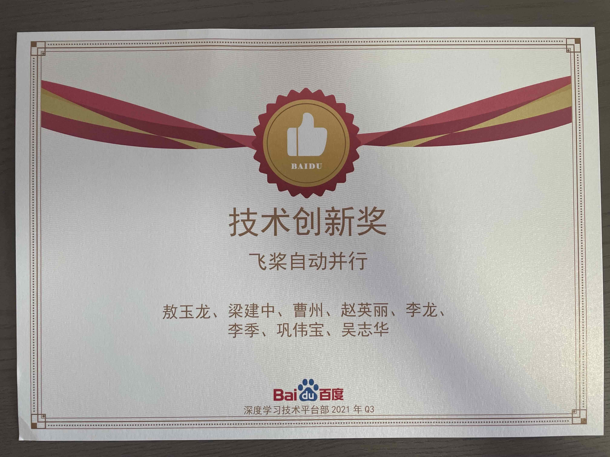
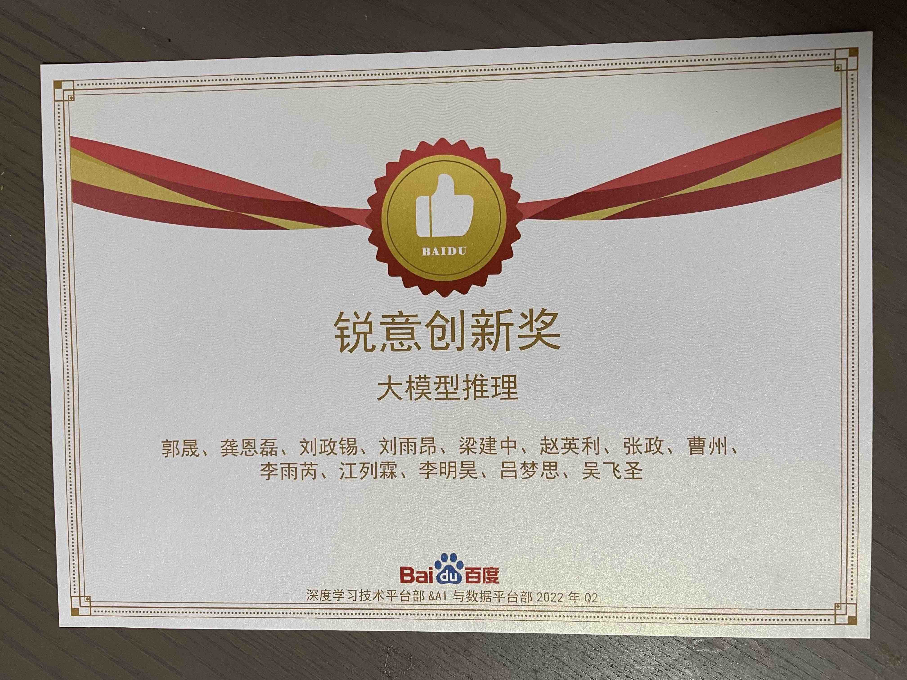

### [MLPerf Project]

### [Hybrid Parallelism Project]

### [10B ERNIE Project]

### [105B & 260B ERNIE Project]

### [Auto Parallelism Project]

### [Auto Parallelism for LLMs Inference]

### [Personal Reward]

### [ERNIE Bot Project]

### [Best Newcomer Award]

